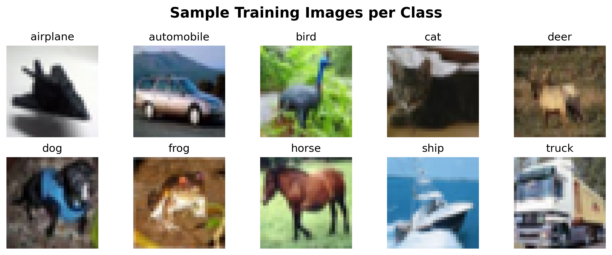
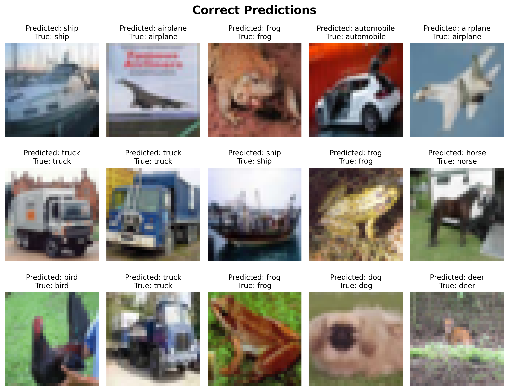
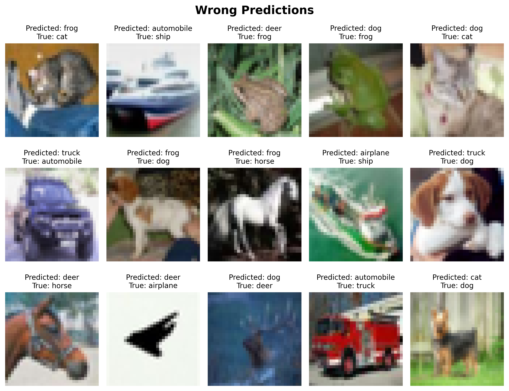

# CIFAR-10 Image Classification

Transfer learning with ResNet50 to classify CIFAR-10 images into 10 categories, using Python (TensorFlow, Keras).

## Tools & Skills Used


## Quick Access

- [View Notebook](notebooks/cifar10-classification.ipynb)

## Setup & Installation

### Prerequisites

- Python 3.12+
- [uv](https://docs.astral.sh/uv/getting-started/installation/) package manager

### 1. Clone the Repository

```bash
git clone https://github.com/krauseannelize/cv-cifar10-classification.git
cd cv-cifar10-classification
```

### 2. Install Dependencies

```bash
uv sync
```

### 3. Run the Project

```bash
uv run jupyter lab
```

📌 **Note:** `uv run` automatically uses the project's virtual environment, no manual activation needed

## Project Overview

This project builds a convolutional neural network (CNN) using transfer learning to classify 32×32 RGB images from the CIFAR-10 dataset into 10 categories: airplane, automobile, bird, cat, deer, dog, frog, horse, ship, and truck. The model leverages a pre-trained ResNet50 backbone (trained on ImageNet) with a custom classification head, following a two-phase training approach to balance feature preservation with task-specific adaptation.



## Objectives

- Implement an end-to-end deep learning pipeline for multi-class image classification
- Apply transfer learning using ResNet50 pre-trained on ImageNet
- Compare performance between frozen-base training (Phase 1) and full fine-tuning (Phase 2)
- Evaluate model performance and identify classification patterns across different object categories

## Methodology

The project follows a structured approach to transfer learning:

1. **Data Preparation:** Load CIFAR-10 dataset, limit training samples to 10,000, and normalize pixel values from 0–255 to 0–1 for neural network compatibility.
2. **Model Architecture:** Initialize ResNet50 with ImageNet weights (excluding the top classification layer), add a custom head with GlobalAveragePooling2D → Dense(128, ReLU) → Dense(64, ReLU) → Dense(10, Softmax).
3. **Phase 1 Training:** Freeze all ResNet50 layers and train only the custom classification head for 10 epochs. This allows the head to learn how to map pre-trained features to CIFAR-10 classes without disrupting learned representations.
4. **Phase 2 Fine-tuning:** Unfreeze the entire model and continue training for 10 more epochs with a lower learning rate (1e-5). This enables the base model to adapt its features to the smaller CIFAR-10 images.
5. **Evaluation:** Assess final performance on the held-out test set using accuracy, classification reports, and confusion matrix analysis.

## Key Findings

- **Final test accuracy:** 40.2%, representing a 4× improvement over random guessing (10%)
- **Phase comparison:** Training accuracy improved from ~30% (Phase 1, frozen base) to ~61% (Phase 2, fine-tuned), with validation accuracy reaching 41%
- **Best performing classes:** Objects with distinctive shapes or colors:
  - ship (51% F1)
  - automobile (45% F1)
  - frog (44% F1)
- **Most challenging classes:** Visually complex objects difficult to distinguish at 32×32 resolution:
  - bird (30% F1)
  - cat (30% F1)
  - dog (34% F1)
- **Common confusions:** Pairs with similar visual characteristics:
  - automobile ↔ truck
  - cat ↔ dog
  - airplane ↔ ship

### Prediction Samples





## Future Improvements

Given more time and resources, the following improvements could boost performance:

- **Data augmentation:** Apply random flips, rotations, and color jittering to artificially expand the training set and reduce overfitting
- **Larger training set:** Use the full 50,000 CIFAR-10 training images instead of the 10,000 sample
- **More epochs:** Continue training beyond 10 epochs per phase, with early stopping based on validation loss
- **Regularization:** Add dropout layers to the classification head to combat the observed overfitting (~19% train-validation gap)
- **Learning rate scheduling:** Implement cosine annealing or reduce-on-plateau to optimize convergence
- **Alternative architectures:** Experiment with models better suited for small images (e.g., EfficientNet-B0, MobileNetV2)
